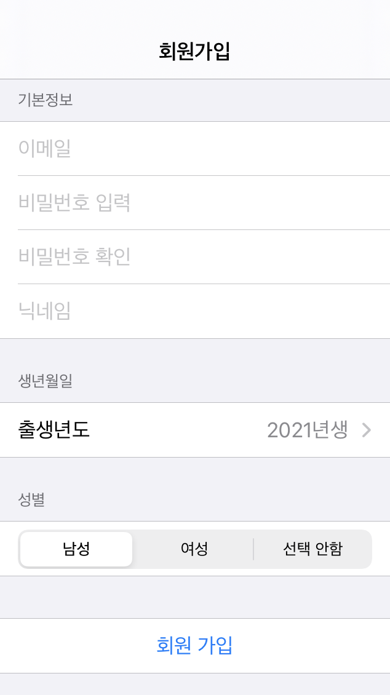
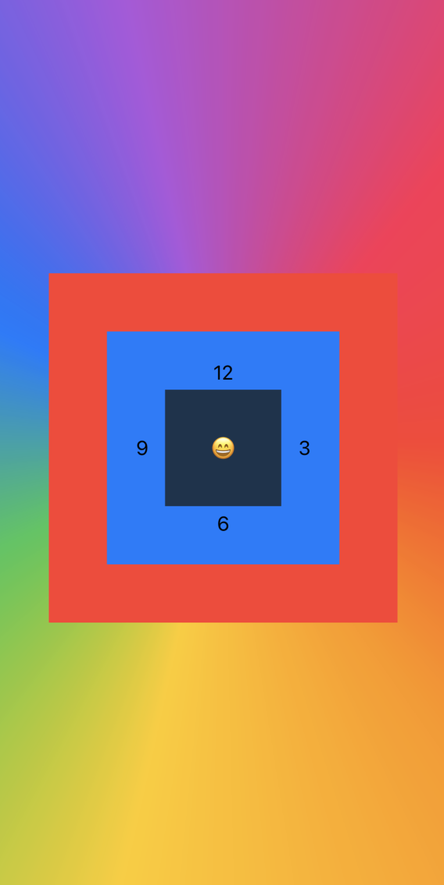
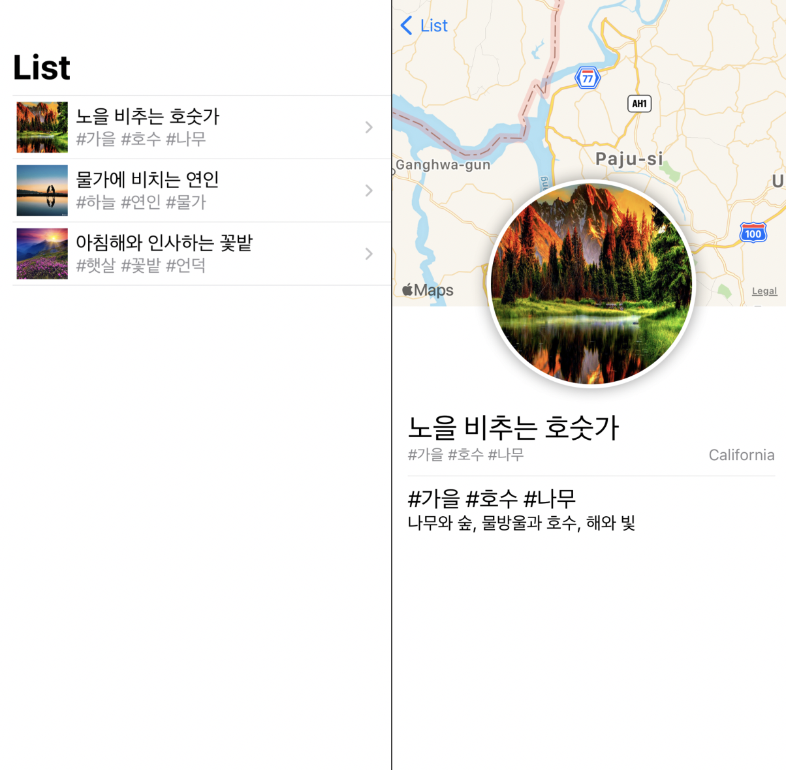

# Study_SwiftUI
Learn how to use SwiftUI and practice SwiftUI by creating various screens.

## Documents
* [SwiftUI 기본 구조](./doc/Basic_Structure_Of_SwiftUI.md)
* 다양한 바인딩 방법 - @State, @Binding, @ObservedObject, @EnvironmentObject

## ScreenShots

## Example
### A. 회원가입 폼을 만들며 배우는 양방향 바인딩
* 21.01.07
* Form, Section, Picker 다뤄보기
* [코드 보기 (👉클릭)](./example/SignUp)

스크린샷 보기 (👉클릭)

 

### B. 스택 다뤄보기
* 21.01.07
* VStack, HStack, ZStack 다뤄보기
* [코드 보기 (👉클릭)](./example/StackExample)

스크린샷 보기 (👉클릭)

 

### C. List와 Navigation
* 21.01.08
* List, NavigationView
* 참고 : [Building Lists and Navigation | Apple Developer - SwiftUI Tutorials](https://developer.apple.com/tutorials/swiftui/building-lists-and-navigation)
* [코드 보기 (👉클릭)](./example/SceneryList)

스크린샷 보기 (👉클릭)

 

### D. GradientDesign
* 21.01.09
* [10 financial ux design trends of 2021](https://medium.muz.li/10-financial-ux-design-trends-of-2021-that-will-transform-digital-banking-ba3777c77d54) 사이트에 있던 [어떤 이미지](./image/design_gradient_card.png)를 보고 디자인 영감을 받아 제작하였습니다.
* [코드 보기 (👉클릭)](./example/GradientDesign)

스크린샷 보기 (👉클릭)

 

## Reference
* [SwiftUI 튜토리얼 전체리스트](https://medium.com/harrythegreat/swiftui-%ED%8A%9C%ED%86%A0%EB%A6%AC%EC%96%BC-%EC%A0%84%EC%B2%B4%EB%A6%AC%EC%8A%A4%ED%8A%B8-f0f2b949743b)
* [zeddios.tistory](https://zeddios.tistory.com/category/SwiftUI?page=2)
