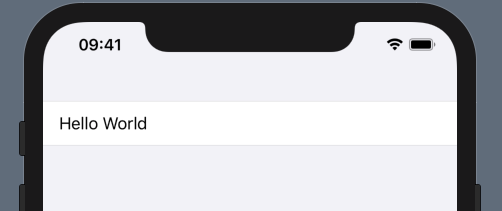
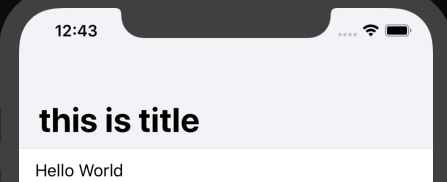
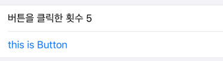

# SwiftUI의 기본 구조
SwiftUI란 UIKit 위에서 빌드되는 프레임워크로 새로운 방식의 UI 인터페이스를 제공하며 선언형 방식의 구조를 가지고 있습니다. 처음 iOS를 배울 때는 AutoLayout을 배우며 constraint로 주변 View와의 관계를 정의하였었는데, 이 `constraint`에 관한 코드가 길어지면 길어질수록 코드의 가독성도 떨어졌습니다. 따라서 얼마 전에 온라인으로 개최되었던 **if kakao 2020** 에서도 잠깐 소개했었던 SwiftUI에 대해서 한 번 알아보겠습니다.

### A. SceneDelegate.swift
SceneDelegate는 iPadOS의 멀티 윈도우와 같은 기능을 지원하기 위한 Delegate입니다. 동일한 앱을 여러 화면에 띄울 경우, AppDelegate가 앱의 전역에서 작동하는데 반해 **SceneDelegate는 각 화면의 인스턴스 단위로 작동**시킬 수 있씁니다.

### B. ContentView.swift
가장 처음 생성되는 simulator를 실행하면 출력되는 View로써, SceneDelegate 클래스의 Scene 메서드에 선언되어 있습니다.

```swift
window.rootViewController = UIHostingController(rootView: contentView)
```

여기서 `UIHostingController`는 SwiftUI View를 인자로 받아 ViewController를 만들어줍니다.

### C. Preview Content
Xcode11 버전부터 Xcode에서 Canvas 기능을 통해 Simulator 없이도 Xcode에서 화면을 미리 볼 수 있게 되었습니다. 아래는 Canvas에서 사용되는 데이터들을 위한 Assets입니다.

```swift
import SwiftUI

struct ContentView: View {
    var body: some View {
        Text("Hello World")
    }
}

struct ContentViewPreviews: PreviewProvider {
    static var previews: some View {
        ContentView()
    }
}
```

ContentView 파일을 확인하면 가장 상단에 import SwiftUI를 선언하여 프레임워크를 가져오고, View를 상속받는 ContentView 구조체가 선언되어 있습니다.

`ContentView` 내부를 보면 body가 View 타입으로 선언되어 있지만 some이라는 키워드가 보입니다. `some`은 Swift 5.1에서 생긴 키워드로, 간단하게 말하자면 <u>특정한 조건을 만족하는 generic type의 View ❓❓</u>라고 할 수 있습니다.

**SwiftUI에서 View는 반드시 body 변수가 있어야 하며**, 이 body는 최상위 View의 역할을 합니다.

### D. Canvas
위 예시 코드 하단에 있는 `ContentViewPreviews`는 실제 앱에는 적용되지 않지만 Xcode의 Canvas 기능을 위한 Preview Layout입니다. Xcode11 이상 버전이라면 Canvas 윈도우를 활성화시킬 수 있습니다.

Canvas 윈도우에 있는 **Resume 버튼 (동그란 아이콘) 을 누르면 지금까지 작성한 코드(View)를 실시간으로 확인**할 수 있습니다. 이 외에도 Canvas에 렌더링 된 View에 GUI 인터페이스를 이용해서 view를 추가할 수도 있습니다.

<br />

이번에는 직접 View를 다루어 보겠습니다. Form을 선언하고 위 예시코드에서 body에 있던 TextView를 Form으로 감싸보겠습니다.

```swift
var body: some View {
    Form {
        Text("Hello World")
    }
}
```

<center>  </center>

그럼 배경이 회색으로 바뀌고 텍스트뷰가 상단으로 올라간 걸 볼 수 있습니다.

`Form`은 주로 **데이터나 설정 등을 다루기 위해 사용하는 컨테이너**입니다. 하지만 Form에 10개가 넘는 View를 넣는다면 오류가 발생합니다. SwiftUI에서 **최상위 View는 최대 10개의 Child View를 가질 수 있기 때문에**, 만약 10개를 초과하게 된다면 아래와 같이 다른 태그를 이용하여 감싸주어야 합니다.

```swift
var body: some View {
    Form {
        Text("Hello World")

        Group {
            Text("Hello World")
            Text("Hello World")
            Text("Hello World")
            Text("Hello World")
            Text("Hello World")
        }

        Group {
            Text("Hello World")
            Text("Hello World")
            Text("Hello World")
            Text("Hello World")
            Text("Hello World")
            Text("Hello World")
            Text("Hello World")
        }
    }
}
```

이렇게 Group을 사용하는 것 말고도, Stack 컨테이너를 이용해서 묶어줄 수도 있습니다.

```swift
var body: some View {
    NavigationView {
        Form {
            Text("Hello World")
        }.navigationBarTitle("this is title")
    }
}
```

이렇게 Form 컨테이너를 `NavigationView` 컨테이너로 감싸주고 실행하게 되면 상단에 Title과 Navigation을 위한 공간이 생기게 됩니다. NavigationView는 기존의 UINavigationController 역할을 하는 컨테이너입니다. 그럼 아래와 같이 화면이 그려집니다.

<center>  </center>

❗️ 여기서 주의해야 할 점은 `navigationBarTitle()`을 NavigationView 태그의 끝이 아닌 Form 태그의 끝에 작성해야 합니다.

<br />

그럼 버튼도 추가한 예제를 보겠습니다. 

아래 코드에서 보이는 `@state`는 뭘까요??

구조체의 특징상 내부 메서드 안에서 자신의 변수를 변경할 수 없기 때문에 Swift5.1에서는 이런 문제를 해결하기 위해 `State 키워드`가 만들어졌습니다. 이런 키워드에 대해서는 다음에 더 자세히 다뤄보겠습니다.

```swift
struct ContentView: View {
    
    @State var touchedCount = 0
    var body: some View {
        NavigationView{
            Form{
                Text("버튼을 클릭한 횟수 \(touchedCount)")
                Button("this is Button"){
                    //버튼을 눌렀을경우 발생하는 callback
                    self.touchedCount += 1
                }
            }.navigationBarTitle("this is title")
        }
    }
}
```

⭐️ SwiftUI에서는 `@State`가 붙은 변수에 변경이 일어나면 자동으로 View를 다시 렌더링하게 됩니다. 

<center> <div>  </div> </center>

## Reference
* [SwiftUI 튜토리얼 1편. 기본구조 | medium](https://medium.com/harrythegreat/swiftui-%ED%8A%9C%ED%86%A0%EB%A6%AC%EC%96%BC-1%ED%8E%B8-%EA%B8%B0%EB%B3%B8%EA%B5%AC%EC%A1%B0-11e7b589e6de)
